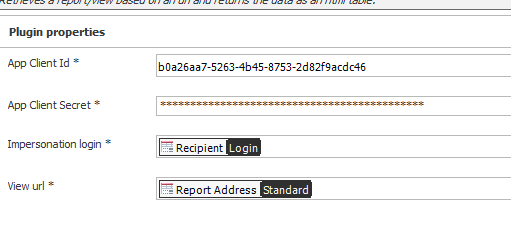
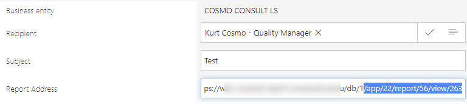
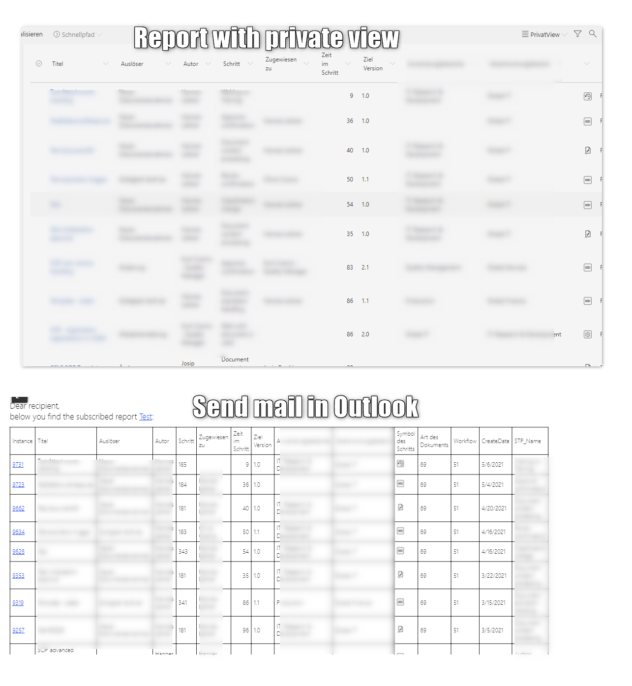

# Short description
CustomBusinessRule + sample application for retrieving report data as an html table to send it via mail

# Custom Business Rule for retrieving report data
## State
Beta version, needs more testing but works quite well.
## Remarks 
An `InternalError: Object reference not set to an instance of an object.` may be thrown if:
- The user does not have permissions for the (private) view / the view does not exist
- Some fields/calculated fields will cause this error, when the report data is retrieved using the API
- The columns Step, Form and Workflow return the Id instead of the name. A workaround for this is to create a calculated field which just returns STP_Name,DTYPE_Name,WF_Name
- For some reason the default `created` columns cause an error, but a calculated field returning the value does work

## Sample SQL statement executed for a report
Calculated columns are name underscoreNumber _##
```sql
exec sp_executesql N' SELECT * FROM (
SELECT

  /*COLUMNS*/
WFD_ID,
CONVERT(varchar(20),WFD_ID) as WFD_ID_String,
WFD_Signature,
DEF_ID,
WFD_RowVersion,
ISNULL(TranslatesSteps.TRANS_Name,ISNULL(SecondaryTranslatesSteps.TRANS_Name,STP_Name)) as STP_Name,
STP_ID,
isnull(
    (select top 1 isnull(WFT_UserName,WFT_User) from dbo.WFElementTasks  where WFT_WFDID=WFD_ID and WFT_WFHID is null and WFT_Isfinished=0 and WFT_AssignTypeID in (1,2) and WFT_OrgID is null and WFT_User = @currentloginname),
    (select top 1 isnull(WFT_UserName,WFT_User) from dbo.WFElementTasks where WFT_WFDID=WFD_ID and WFT_WFHID is null and WFT_Isfinished=0 and WFT_AssignTypeID in (1,2) and WFT_OrgID is null order by isnull(WFT_UserName,WFT_User))
  ) as AssignedPerson,
dbo.ClearWFElemAdvLanguage(ISNULL(WFD_AttChoose16, ''''), ''en'') as WFD_AttChoose16,
dbo.ClearWFElemIDAdv(ISNULL(WFD_AttChoose16, '''')) as WFD_AttChoose16_ID,
ISNULL(WFD_AttChoose16, '''') as WFD_AttChoose16_BPS,
datediff(d,WFD_EnterToCurrentStepDate,dbo.GetDbDate()) as WFD_StepDuration,
ISNULL(WFD_AttText1, '''') as WFD_AttText1,
dbo.ClearWFElemAdv(ISNULL(WFD_AttChoose6, '''')) as WFD_AttChoose6,
dbo.ClearWFElemIDAdv(ISNULL(WFD_AttChoose6, '''')) as WFD_AttChoose6_ID,
ISNULL(WFD_AttChoose6, '''') as WFD_AttChoose6_BPS,
ISNULL(WFD_AttText3, '''') as WFD_AttText3,
dbo.ClearWFElemAdv(ISNULL(WFD_AttChoose7, '''')) as WFD_AttChoose7,
dbo.ClearWFElemIDAdv(ISNULL(WFD_AttChoose7, '''')) as WFD_AttChoose7_ID,
ISNULL(WFD_AttChoose7, '''') as WFD_AttChoose7_BPS,
dbo.ClearWFElemAdv(ISNULL(WFD_AttChoose2, '''')) as WFD_AttChoose2,
dbo.ClearWFElemIDAdv(ISNULL(WFD_AttChoose2, '''')) as WFD_AttChoose2_ID,
ISNULL(WFD_AttChoose2, '''') as WFD_AttChoose2_BPS,
STP_ID as WFD_Image,
ISNULL(TranslatesDoctypes.TRANS_Name,ISNULL(SecondaryTranslatesDoctypes.TRANS_Name,DTYPE_Name)) as DTYPE_Name,
DTYPE_ID,
ISNULL(TranslatesWorkflows.TRANS_Name,ISNULL(SecondaryTranslatesWorkflows.TRANS_Name,WF_Name)) as WF_Name,
WF_ID,
CONVERT(varchar(16),WFD_TSInsert, 121) as WFD_TSInsert,
CONVERT(varchar(16),WFD_TSInsert, 121) as WFD_TSInsert_DateOnly,
WFD_TsInsert as _1 /*ROWNUMBER*/ , ROW_NUMBER() OVER ( ORDER BY WFD_ID DESC ) as RowNumber /*ROWNUMBER_END*/                        
  /*COLUMNS_END*/
FROM V_WFElements as wfelems
    
    LEFT JOIN Translates AS TranslatesSteps ON (STP_ID = TranslatesSteps.TRANS_ELEMID AND TranslatesSteps.TRANS_OBJID = 5 AND TranslatesSteps.TRANS_LANID = 10)
LEFT JOIN Translates AS SecondaryTranslatesSteps ON (STP_ID = SecondaryTranslatesSteps.TRANS_ELEMID AND SecondaryTranslatesSteps.TRANS_OBJID = 5 AND SecondaryTranslatesSteps.TRANS_LANID = 0)
LEFT JOIN Translates AS TranslatesWorkflows ON (WF_ID = TranslatesWorkflows.TRANS_ELEMID AND TranslatesWorkflows.TRANS_OBJID = 3 AND TranslatesWorkflows.TRANS_LANID = 10)
LEFT JOIN Translates AS SecondaryTranslatesWorkflows ON (WF_ID = SecondaryTranslatesWorkflows.TRANS_ELEMID AND SecondaryTranslatesWorkflows.TRANS_OBJID = 3 AND SecondaryTranslatesWorkflows.TRANS_LANID = 0)
LEFT JOIN Translates AS TranslatesDoctypes ON (DTYPE_ID = TranslatesDoctypes.TRANS_ELEMID AND TranslatesDoctypes.TRANS_OBJID = 13 AND TranslatesDoctypes.TRANS_LANID = 10)
LEFT JOIN Translates AS SecondaryTranslatesDoctypes ON (DTYPE_ID = SecondaryTranslatesDoctypes.TRANS_ELEMID AND SecondaryTranslatesDoctypes.TRANS_OBJID = 13 AND SecondaryTranslatesDoctypes.TRANS_LANID = 0)

    
WHERE WFD_ID IN (
 select wfd_id from WFElements JOIN WFDocTypes ON WFD_DTYPEID = DTYPE_ID JOIN WFSteps ON WFD_STPID = STP_ID 
  where WFD_DTYPEID in (69) and WFD_STPID in (171,172,173,174,175,176,177,178,179,180,181,182,183,184,185,186,187,188,189,190,191,199,200,341,342,343,457,458) /*ADVANCEDINNERSEARCH*/ and WFD_IsFinish=0    AND (1=1 ) 

)

  ) AS Results WHERE RowNumber > @lowerBand AND RowNumber < @upperBand  ORDER BY WFD_ID DESC ',N'@currentloginname nvarchar(36),@lowerBand int,@upperBand int',@currentloginname=N'dummy',@lowerBand=0,@upperBand=51
```

## Test project
I wanted to concentrate on testing, therefore the testing project reads a configuration file with the necessary information. Because of sensitive information this file is stored in the temp folder. Steps to create the file:
1. Build the project
2. Run the PowerShell script `ReportSubscriptions\ReportSubscriptions.Test\WriteConfigurationFile.ps1` and provide the requested information.

Afterwards you can run the testing project.

# Application
State: alpha
WEBCON BPS Version: 2021.1.2.136

The current application is an alpha version for testing the business rule.
The configuration of the plugin requires the client id and secret of a registered application.
See https://community.webcon.com/posts/post/examples-of-using-rest-api/109 for more details.


You can test the plugin by starting a workflow, provide a recipient some subject and the address to the report/view.
The API supports also private views.
 

A sample report and the received mail:
 

